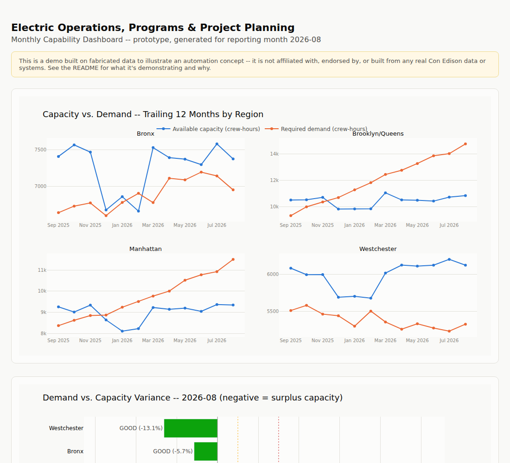

# Electric Operations Capability Dashboard (Prototype)

**[Live demo](https://github.com/acalderon3/con-edison-capacity-forecast-demo)** -- update this link once GitHub Pages is enabled (see below).

A working prototype that automates the monthly capacity-vs-demand reporting
cycle described in a real "Project Specialist, Electric Operations PMO --
Programs & Project Planning" job posting. **This project is not affiliated
with, endorsed by, or built from any real Con Edison data or systems.** Every
number in it is fabricated. It exists to demonstrate an automation concept,
not to represent any company's actual operations.

## The problem this is modeling

The posting that inspired this described a role that, among other things,
manually forecasts crew capacity against work-plan demand and hand-builds
Power BI dashboards across multiple source systems (a work-management system
and Oracle BI) to produce a monthly capability report for leadership. That's
a recurring, structurally repetitive task: pull numbers from two systems,
compare them, flag where demand is outrunning capacity, chart it, and write
up what it means -- every month, by hand.

## What the prototype does

Given two source extracts (here, mocked CSVs standing in for WMS and Oracle
BI exports), it:

1. **Aggregates** crew-hour capacity and work-order-backlog demand by region
   and month.
2. **Flags variance** against configurable thresholds (default: >=5% =
   warning, >=15% = critical) so over-capacity regions surface automatically
   instead of being eyeballed off a spreadsheet.
3. **Charts** a trailing-12-month capacity-vs-demand trend per region, a
   current-month variance/status bar chart, and a five-year capital-plan
   forecast.
4. **Drafts the monthly narrative** -- the write-up a specialist currently
   composes by hand -- using Claude if `ANTHROPIC_API_KEY` is set, or a
   deterministic template if not (so the demo runs with zero keys
   configured).
5. **Outputs** one self-contained HTML dashboard and one markdown report.

What used to be a multi-system, hand-built monthly exercise becomes: run two
scripts, get a dashboard and a written summary in seconds.



## How the mock data is shaped

`src/generate_mock_data.py` builds three CSVs with a fixed random seed
(`42`, for reproducibility) under `data/`:

- **`crew_capacity.csv`** -- monthly available crew-hours per region, trailing
  12 months, with a mild seasonal winter dip.
- **`work_order_backlog.csv`** -- monthly required hours per region and
  program, split across five work programs with randomized priority tags.
- **`five_year_forecast.csv`** -- an annualized five-year capital-plan hours
  forecast per region.

Demand growth rates are deliberately set so Manhattan and Brooklyn/Queens
outrun their capacity, Bronx roughly tracks it, and Westchester stays under
-- so the variance/status logic downstream has something real to flag,
mirroring the kind of unevenness a real regional utility would see.

## Running it

```bash
python3 -m venv .venv && source .venv/bin/activate
pip install -r requirements.txt

python src/generate_mock_data.py   # writes data/*.csv
python src/build_dashboard.py      # writes output/capability_dashboard.html + monthly_capability_report.md
```

Then open `output/capability_dashboard.html` in a browser. It's fully
self-contained (Plotly is inlined), so it works offline and can be emailed
or dropped anywhere without a build step.

To get an LLM-drafted narrative instead of the template fallback, copy
`.env.example` to `.env`, set `ANTHROPIC_API_KEY`, and export it into your
shell before running `build_dashboard.py` (or `source .env` if you're using
a tool that loads it automatically).

## Publishing it

The repo already includes `docs/index.html` (a copy of the dashboard) so
GitHub Pages can serve it with zero extra setup:

1. Push this repo to GitHub (create an empty repo on github.com, then
   `git remote add origin <url>` and `git push -u origin master`).
2. In the repo, go to **Settings -> Pages**.
3. Under **Build and deployment**, set **Source** to "Deploy from a branch,"
   **Branch** to `master` (or `main`), **Folder** to `/docs`, then **Save**.
4. GitHub builds it in a minute or two; the live URL appears at the top of
   that same Pages settings screen (`https://<your-username>.github.io/<repo-name>/`).
5. Swap that URL into the "Live demo" link at the top of this README.

If you regenerate the dashboard with `build_dashboard.py`, re-copy it over
`docs/index.html` (`cp output/capability_dashboard.html docs/index.html`)
and push again to update the live version.

## Stack

pandas for aggregation, Plotly for charting, the Anthropic SDK (optional)
for the narrative draft. No database, no backend -- it's two scripts and a
static HTML output, which is the point: the automation is the pipeline, not
the infrastructure around it.

## Scope and limitations

This is a ~2-day prototype, not a production system. Known gaps:

- No dark mode (the dashboard is light-theme only).
- Variance thresholds (5% / 15%) are illustrative defaults, not derived from
  any real operational tolerance.
- The five-year forecast is a simple compounded-growth projection, not a
  capital-planning model.
- No auth, no live system integration -- CSVs stand in for WMS/Oracle BI
  exports, which is intentional for a demo but would be the first thing to
  replace in a real deployment.
